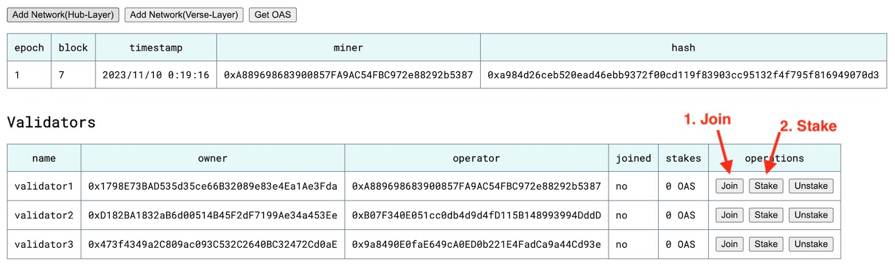

# Oasys Private OPStack
Using this repository, you can set up private L1 and L2 Oasys networks. The L2 network utilizes the opstack version of Verse.
This repo was initially created for internal opstack integration testing.

## Setup L1 and OP Stack 

### Clone repositories

Clone repositories to any location you prefer.

```shell
# mkdir ~/your/dev/dir && cd ~/your/dev/dir

git clone --recursive https://github.com/oasysgames/oasys-validator.git 

git clone https://github.com/oasysgames/oasys-opstack.git

git clone https://github.com/oasysgames/oasys-op-geth.git

git clone https://github.com/oasysgames/opstack-message-relayer
```

The `oasys-validator` repository checks out a release tag for a testnet that allows for free contract deployment.

```shell
cd oasys-validator/

# check the latest release tag
git tag | grep testnet

git checkout xxx-testnet
```

### Create `.env` file

Copy the sample.
```shell
cp .env.sample .env
```

Add the absolute path of the repository cloned earlier.
```dotenv
L1_GETH_REPO=<oasys-validator>
OP_MONO_REPO=<oasys-opstack>
OP_GETH_REPO=<oasys-op-geth>
MR_REPO=<opstack-message-layer>
```

### Build components

Build the L1 geth and OP Stack components.

```shell
docker-compose -f ./docker-compose.build.yml up

# build a specific component (fast)
docker-compose -f ./docker-compose.build.yml up {l1-geth,op-geth,op-node,op-batcher,op-proposer,message-relayer}
```

The built binaries are created within each repository.

| Layer | Component | Repo/Path |
| --- | --- | --- |
| L1 | geth | oasys-validator/build/bin/geth |
| OP Stack | geth | oasys-op-geth/build/bin/geth |
| OP Stack | op-node | op-monorepo/op-node/bin/op-node |
| OP Stack | op-batcher | op-monorepo/op-batcher/bin/op-batcher |
| OP Stack | op-proposer | op-monorepo/op-proposer/bin/op-proposer |

### Run L1 Services

Run services of L1.
```shell
docker-compose up -d l1-web l1-rpc l1-validator1 l1-blockscout
```

> l1-validator2 and l1-validator3 are optional.

L1 block creation starts automatically, so execute `l1-validator1` staking within the 1st epoch (40 blocks). Open the l1-web ([http://127.0.0.1:8080/](http://127.0.0.1:8080/)) and click `1. Join` and `2. Stake` button. 



Open the L1 explorer ([http://127.0.0.1:4000/](http://127.0.0.1:4000/)).

### Generate `.envrc`

Generate a `.envrc` file within the op-monorepo repository.

```shell
docker-compose run --rm foundry 'bash /misc/foundry/envrc.sh > /op-monorepo/.envrc'
```

### Deploy OPStack contracts to L1 using the factory contract

```shell
cd op-monorepo/

# load .envrc
direnv allow

# Installation of dependencies.
pnpm install && pnpm build

# Salt(uint256) to be passed to create2 opcode.
export SALT=$(date +%s)

# Wallet to run PermissionedContractFactory.
# This is a HardHat develop account. (address: 0xf39Fd6e51aad88F6F4ce6aB8827279cffFb92266)
export HH_ACCOUNT_0=0xac0974bec39a17e36ba4a6b4d238ff944bacb478cbed5efcae784d7bf4f2ff80

# Deploy OPStack factory contract to L1 via PermissionedContractFactory.
cd packages/contracts-bedrock/

forge script --rpc-url $L1_RPC_URL --private-key $HH_ACCOUNT_0 --broadcast \
  scripts/oasys/L1/build/Deploy.s.sol:Deploy

# Deploy OPStack contracts to L1 using the factory.
# Note: You can use any private key.
forge script --rpc-url $L1_RPC_URL --private-key $HH_ACCOUNT_0 --broadcast \
  scripts/oasys/L1/build/Build.s.sol:Build

# Set the message relayer address to the OasysPortal.
forge script --rpc-url $L1_RPC_URL --sender $OP_ADMIN_ADDR --private-key $OP_ADMIN_KEY --broadcast \
  scripts/oasys/L1/build/Build.s.sol:SetMessageRelayer

# Get the address of the `L2OutputOracleProxy` contract.
jq -r .L2OutputOracleProxy tmp/oasys/L1/build/Build.s.sol/latest/addresses.json
# Get the address of the `AddressManager` contract
jq -r .AddressManager tmp/oasys/L1/build/Build.s.sol/latest/addresses.json
# Get the address of `L1CrossDomainMessengerProxy` contract
jq -r .L1CrossDomainMessengerProxy tmp/oasys/L1/build/Build.s.sol/latest/addresses.json
# Get the address of `OptimismPortalProxy` contract
jq -r .OptimismPortalProxy tmp/oasys/L1/build/Build.s.sol/latest/addresses.json
```

Finally, set the address of the L2OutputOracleProxy as `OP_L2OO_ADDR` in the `.env` file.

```dotenv
OP_L2OO_ADDR=<here>
```

### Generate `genesis.json` and `rollup.json`

Generate a `genesis.json` and `rollup.json` for the OP Stack.

```shell
docker-compose run --rm --no-deps op-node genesis l2 \
  --deploy-config /op-monorepo/packages/contracts-bedrock/tmp/oasys/L1/build/Build.s.sol/latest/deploy-config.json \
  --l1-deployments /op-monorepo/packages/contracts-bedrock/tmp/oasys/L1/build/Build.s.sol/latest/addresses.json \
  --outfile.l2 /data/genesis.json \
  --outfile.rollup /data/rollup.json \
  --l1-rpc http://l1-rpc:8545/

# check the generated files
ls -l data/op-node/{genesis.json,rollup.json}
```

### Generate op-geth genesis block

```shell
docker-compose run --rm op-geth init /op-node/genesis.json

# output on success
INFO [11-09|16:06:49.261] Successfully wrote genesis state         database=lightchaindata                      hash=1498e7..1a0467
```

### Run OP Stack Services

Run services of OP Stack.
```shell
docker-compose up -d op-geth op-node op-batcher op-proposer op-blockscout message-relayer
```

Open the OP Stack explorer ([http://127.0.0.1:4001/](http://127.0.0.1:4001/)). If op-geth and op-node are running correctly, blocks should be being created every 5 seconds.

### Run OP Stack Replica Services

Generate the genesis block of the replica op-geth.
```shell
docker-compose run --rm op-geth-replica init /op-node/genesis.json
```

Run replica services.
```shell
docker-compose up -d op-geth-replica op-node-replica op-blockscout-replica
```

Open the replica explorer ([http://127.0.0.1:4002/](http://127.0.0.1:4002/)). L2 block is synchronized with about a 1-minute delay. Synchronization can be sped up by reducing the `--verifier.l1-confs` in the op-node-replica service.

## Setup OP Stack SDK

To use the [OP Stack SDK](https://community.optimism.io/docs/sdk/) on a private chain, take a few [extra steps](https://stack.optimism.io/docs/build/sdk/#not-natively-supported-chains) is required. By using this script, you can skip those steps and use the SDK.
```shell
docker-compose run --rm -v /tmp:/work foundry 'bash /misc/foundry/sdk.sh > /work/sdk.js'
```

Example of JavaScript.
```javascript
const opsdk = require("/tmp/sdk")

const { l1Provider, l2Provider } = opsdk.getProviders()
const { l1Signer, l2Signer } = opsdk.getSigners({ privateKey, l1Provider, l2Provider });
const crossChainMessenger = opsdk.getCrossChainMessenger({ l1Signer, l2Signer });
```

Example of TypeScript.
```typescript
import * as opsdk from "/tmp/sdk";

const { l1Provider, l2Provider } = opsdk.getProviders();
const { l1Signer, l2Signer } = opsdk.getSigners({ privateKey, l1Provider, l2Provider });
const crossChainMessenger = opsdk.getCrossChainMessenger({ l1Signer, l2Signer });
```


## FAQs

### How to get the OAS？

The L1 OAS can be received from the Faucet by opening l1-web ([http://127.0.0.1:8080/](http://127.0.0.1:8080/)) and using `Get L1 OAS`. The OPStack OAS needs to be bridged from L1.

### Blocks are not synchronizing between `l1-rpc` and `l1-validator`

The IP address of the container changes with start/stop, but geth may be caching the old IP address. Try deleting the cache with the following command.

```shell
docker-compose stop l1-rpc l1-validator1

rm -rf data/l1-*/geth/nodes 

docker-compose up -d l1-rpc l1-validator1
```

### How to reset L1 and OP Stack?

Stop all services.
```shell
docker-compose down --remove-orphans --volumes
```

Delete container data.
```shell
rm -rf data
```

Delete data within op-monorepo.
```shell
rm -rf packages/contracts-bedrock/deploy-config/getting-started.json\
       packages/contracts-bedrock/deployments/getting-started
```

Then repeat the steps after [Run L1 Services](#run-l1-services).

### How to create forked chains?
```sh
# Stop L1 containers, need to stop all to prevent reconnecting each other again
docker-compose stop l1-rpc l1-validator1 l1-validator2 l1-validator3

# Delete P2P caches
rm -rf ./data/l1-*/geth/nodes

# Modify the entrypoint scripts as follows
# Only apply to the miner chain's. Doesn't change the major chain
# Remove (or comment out) `--bootnodes $BOOTNODES` in ./l1/validator/entrypoint.sh

# Start containers
docker-compose start
```
